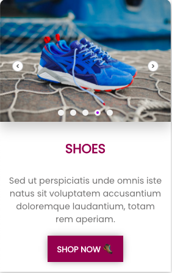

Exclusive ready to use e-commerce components to power your business

_**Note**_:

- All the below are `react` components

- In your react projects, install the dependancies using npm (or) yarn

In case of npm

```bash
npm i nutro-components
```

In case of yarn

```bash
yarn add nutro-components
```

## Quantity control button

One of the most common component - quantity control button to add/remove items


import "./style.css";

### React version

```jsx
import { QuantityButton } from "nutro-components";

<QuantityButton />;
```

## Switch/Toggle

Veg/Non veg toggle component


import "./style.css";

### React version

| Prop  | description            | type    | Value       | Default |
| ----- | ---------------------- | ------- | ----------- | ------- |
| state | active state of switch | boolean | false, true | false   |

```jsx
import { EcomToggle } from "nutro-components";

<EcomToggle />;
```

## Image magnifier

Zoom in images for preview


import "./style.css";

### React version

| Prop          | description                   | type    | Value      | Default |
| ------------- | ----------------------------- | ------- | ---------- | ------- |
| images        | pass 2 images of 687 & 1200px | array   | -          | -       |
| isHintEnabled | show hint for users           | boolean | true/false | false   |

```jsx
import { ImageMagnify } from "nutro-components";

// replace the path with your image folder paths
import watchImg687 from './lib/components/Ecommerce/images/wristwatch_687.jpeg';
import watchImg1200 from './lib/components/Ecommerce/images/wristwatch_1200.jpeg';

const images = [watchImg687, watchImg1200]

<ImageMagnify images={images} isHintEnabled={true} />

```

## Slider components

Product slider components - card slider, enlarged preview slider


<br />
<br />


import "./style.css";

### React version

| Prop        | description                                   | type    | Value      | Default |
| ----------- | --------------------------------------------- | ------- | ---------- | ------- |
| slideimages | pass list of images to be added to the slider | array   | -          | -       |
| dot         | show dots indicator                           | boolean | true/false | false   |
| preview     | show dots indicator                           | boolean | true/false | false   |
| autoplay    | autoplay timings in seconds                   | number  | -          | null    |
| size        | small/large slider                            | string  | sm, lg     | sm      |

```jsx
import { Slider } from "nutro-components";

// replace the path with your image folder paths
/* slider related imports */
import styles from  './lib/components/Ecommerce/slider/slider.module.css'
import Slider from './lib/components/Ecommerce/slider/ProductSlider'
import ShoeOne from './lib/components/Ecommerce/slider/images/shoe1.jpg'
import ShoeTwo from './lib/components/Ecommerce/slider/images/shoe2.jpg'
import ShoeThree from './lib/components/Ecommerce/slider/images/shoe3.jpg'
import ShoeFour from './lib/components/Ecommerce/slider/images/shoe4.jpg'
import ShoeFive from './lib/components/Ecommerce/slider/images/shoe5.jpg'

// list of images for the slider
const slideimages = [ShoeOne, ShoeTwo, ShoeThree, ShoeFour, ShoeFive]

//card slider section
<div className = {styles.card}>
    <Slider
        size = "sm"
        slideimages = {slideimages}
        autoplay = {3}
        dot = {true}
    />
    <div className = {styles.cardcontent}>
        <h4 className={styles.heading}>SHOES</h4>
        <p className = {styles.cardtext}>Sed ut perspiciatis unde omnis iste natus sit voluptatem accusantium doloremque
                laudantium, totam rem aperiam. </p>
    </div>
    <div className = {styles.footer}>
        <button>SHOP NOW 🥾</button>
    </div>
</div>

// enlarge preview slider section
<div className = "big-slider">
        <Slider
        size = "lg"
        slideimages = {slideimages}
        autoplay = {3}
        dot = {true}
        preview = {true}/>
     </div>
```

## Product Card

Product information card with pricing details & quantity button


import "./style.css";

### React version

_Note:_ The image enlarges with slight transition when hovered

Demo product object

```js
const product = {
  image: BurgerImage,
  name: "Butter Paneer Kulcha Burger",
  isVeg: false,
  description: "557 Cal | High protein",
  actualPrice: "₹ 209",
  discountedPrice: "₹ 104",
};
```

```jsx
import { ProductCard } from "nutro-components";

// replace the path with your image folder paths
import BurgerImage from './lib/components/Ecommerce/images/burger.jpeg'

const product = {
  image: BurgerImage,
  name: 'Butter Paneer Kulcha Burger',
  isVeg: false,
  description: '557 Cal | High protein',
  actualPrice: '₹ 209',
  discountedPrice: '₹ 104'
}

<ProductCard product={product} />

```
