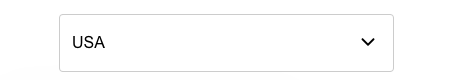

Educative.io is an ed-tech website with awesome clean UI. Few components inspired from their site can be found below

Check educative.io original website [here](https://www.educative.io/)

_**Note**_:

- All the below are `react` components

- In your react projects, install the dependancies using npm (or) yarn

In case of npm

```bash
npm i nutro-components
```

In case of yarn

```bash
yarn add nutro-components
```

## Buttons

Educative.io flavoured buttons of different states


import "./style.css";

### React version

| Prop | Value                               | Default  |
| ---- | ----------------------------------- | -------- |
| type | primary, primary_outlined, outlined | outlined |

```jsx
import { EdButton } from "nutro-components";

<EdButton type='primary'>Explore courses</EdButton>
<EdButton type='outlined'>Explore courses</EdButton>
<EdButton type='primary_outlined'>Explore courses</EdButton>
```

## Search Input

Educative.io flavoured Search Input component


import "./style.css";

### React version

```jsx
import { EdSearch } from "nutro-components";

<EdSearch />;
```

## Select Input

Educative.io flavoured custom select component




import "./style.css";

### React version

| Prop    | Value            |
| ------- | ---------------- |
| options | array of options |

```jsx
import { EdButton } from "nutro-components";
const options = [
  {id: 1, name: 'USA'},
  {id: 2, name: 'Canada'},
  {id:3, name: 'UK'},
  {id:4, name: "Brazil"},
  {id:5, name: 'India'}
]
<EdSelect options={options} />;
```

## Cookie Banner

Educative.io flavoured custom cookie banner - mobile & desktop version


import "./style.css";

### React version

| Prop       | type   |
| ---------- | ------ |
| cookieText | string |
| buttonText | string |

```jsx
import { CookieBanner } from "nutro-components";

const cookieText = 'We use cookies to ensure you get the best experience on our website. Please review our <a className={styles.underline} href="/#">Privacy Policy</a> to learn more.'
const buttonText = 'Got it!'

<CookieBanner cookieText={cookieText} buttonText={buttonText}/>
```
