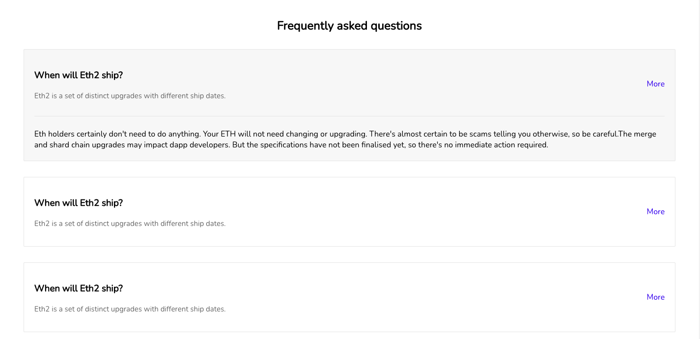
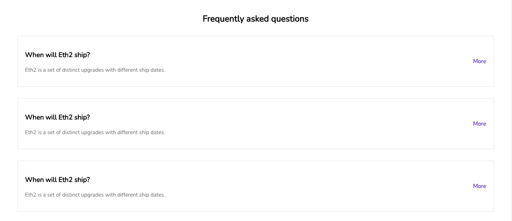

Quick & easy to fit-in FAQ components

_**Note**_:

- All the below are `react` components

- In your react projects, install the dependancies using npm (or) yarn

In case of npm

```bash
npm i nutro-components
```

In case of yarn

```bash
yarn add nutro-components
```

## FAQ - inspired from ethereum website

Ethereum offical website has a FAQ which was quite different & thus we built this one to plug & play




import "./style.css";

### React version

| Prop  | type             | Default                    |
| ----- | ---------------- | -------------------------- |
| faqs  | array of objects | -                          |
| title | text             | Frequently asked questions |

```jsx
import { EthFAQ } from "nutro-components";

const faqs = [
  {
    question: "When will Eth2 ship?",
    answer: "Eth2 is a set of distinct upgrades with different ship dates.",
    more:
      "Eth holders certainly don't need to do anything. Your ETH will not need changing or upgrading. There's almost certain to be scams telling you otherwise, so be careful.The merge and shard chain upgrades may impact dapp developers. But the specifications have not been finalised yet, so there's no immediate action required.",
    isActive: false,
  },
  {
    question: "How do I prepare for Eth2?",
    answer: "You don't have to do anything right now to prepare for Eth2.",
    more:
      "Eth holders certainly don't need to do anything. Your ETH will not need changing or upgrading. There's almost certain to be scams telling you otherwise, so be careful.",
    isActive: false,
  },
];
<EthFAQ faqs={faqs} />;
```
