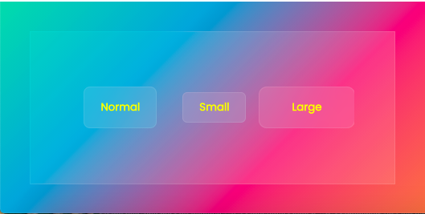

Simple & intuitive glassmorphism components that can be used in your websites

_**Note**_:

- All the below are `react` components

- In your react projects, install the dependancies using npm (or) yarn

In case of npm

```curl
npm i nutro-components
```

In case of yarn

```curl
yarn add nutro-components
```

## Glassmorphism buttons

Some awesome glassmorphism buttons of different flavours that you can plug & play in your apps



import "./style.css";

### React version

| Prop    | Value                | Default |
| ------- | -------------------- | ------- |
| onClick | click action logic   | -       |
| size    | normal, large, small | normal  |

```jsx
import { GlassButton } from "nutro-components";

<GlassButton type="glass">Normal</GlassButton>
<GlassButton type="glass" size="small">Small</GlassButton>
<GlassButton type="glass" size="large" onClick={() => alert('button clicked')}>Large</GlassButton>
```

_**Note**_:

Glassmorphism components looks better in bright gradient like backgrounds. To get the background just like the above one

```jsx
import { GlassButton } from "nutro-components";

<div className="glassmorphism">
  <div className="inner">
    <GlassButton type="glass">Normal</GlassButton>
    <GlassButton type="glass" size="small">
      Small
    </GlassButton>
    <GlassButton
      type="glass"
      size="large"
      onClick={() => alert("button clicked")}
    >
      Large
    </GlassButton>
  </div>
</div>;
```

```css
.glassmorphism {
  width: 10cm;
  height: 7cm;
  background: linear-gradient(-45deg, #ee7752, #e73c7e, #23a6d5, #23d5ab);
  display: flex;
  justify-content: center;
  align-items: center;
}
.inner {
  width: 8cm;
  height: 5cm;
  background-color: rgba(255, 255, 255, 0.1);
  border: 1px solid rgba(255, 255, 255, 0.1);
  display: flex;
  justify-content: center;
  align-items: center;
}
```
